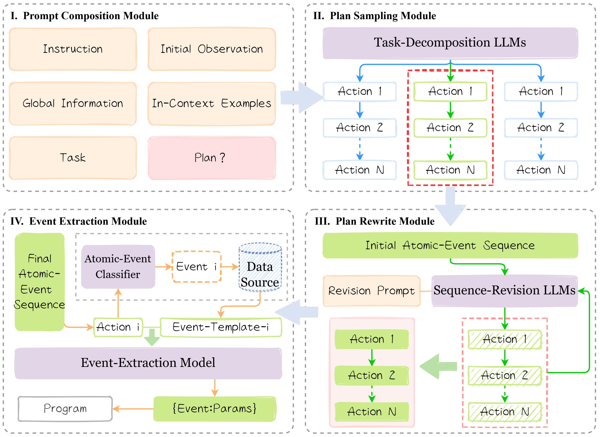

# TPEE: Event-Structured LLM Planning for Continuous-Parameter Industrial Workflows

✨ This repository provides the official implementation and dataset for **"TPEE: Event-Structured LLM Planning for Continuous-Parameter Industrial Workflows"** (*submitted to ICAPS 2026*).

> 💡 If any link below loads slowly on Anonymous GitHub, please expand all folders in the left sidebar first and then retry.

 

 ---

## 🔍 Overview
TPEE is an event-structured planning framework for continuous-parameter industrial workflows built upon large language models (LLMs). It targets realistic laser-etching scenarios with complex machine states and long-horizon task dependencies.

This repository includes:
- **LEIA-Plan**, an industrial-scale dataset with atomic events and multi-step workflows
- Structured **event templates** and annotated atomic operations
- Prompt templates for **task decomposition**, **plan sampling**, **plan selection**, and **plan rewriting**
- Reference code (under active development)

---

## 📝 LEIA-Plan Dataset
[LEIA-Plan](./LEIA-Plan/) is a laser-etching industrial dataset constructed from real operational scenarios involving five-axis CNC machines, dynamic-focusing galvanometers, cameras, and pulsed fiber lasers.

### 🔹 Events
A large collection of atomic operation commands from real industrial processing scenarios is summarized in [events](./LEIA-Plan/events/).

- [event-template](./LEIA-Plan/events/event-template.json) defines **24 event types**, including their categories and parameter structures.
- The wording of event templates slightly differs from the *Global Information* used in TPEE prompts.

The following table shows the correspondence between event templates and the Global Information used in prompts:

| Event Template | Global Information |
| :---: | :---: |
| Machine-File | Machine Formula Selection |
| Machine-Connect | Machine Connection / Disconnection |
| Machine-AxisConfig | Machine Axis Configuration |
| Machine-Parameters | Machine Structural Parameters Setting |
| Machine-AxisEnable | Machine Enable Switch |
| Machine-Move | Machine Movement |
| Machine-Home | Machine Axis Homing |
| Machine-Stop | Machine Stop |
| Board-File | Scanner Correction File Selection |
| Board-Connect | Scanner Connection / Disconnection |
| Board-Parameters | Scanner Parameters Setting |
| Board-Offset | Scanner Offset Setting |
| Camera-File | Camera Calibration File Selection |
| Camera-Select | Camera Selection |
| Laser-Connect | Laser Connection / Disconnection |
| Laser-Operate | Laser Operation |
| Laser-Parameters | Laser Parameter Setting |
| Tool-Parameters | Tool Structural Parameters Setting |
| Tool-Switch | Tool Switching |
| Tool-RetractEnable | Tool Retraction Enable Switch |
| Tool-RetractDistance | Tool Retraction Distance Setting |
| Tool-Move | Tool Movement |
| Process-Parameters | Processing Parameters Setting |
| Process-Operate | Processing Operation |

- [atomic-event-data](./LEIA-Plan/events/atomic-event-data.json) contains **672 annotated atomic operations**, including event classification labels and extraction annotations, and is used for fine-tuning the event extraction model.
- [extract-entity-data](./LEIA-Plan/events/extract-entity-data.json) provides refined categorical annotations for discrete parameters, used to fine-tune a BERT-based parameter classifier.

### 🔹 Workflow
The workflow data consists of representative user tasks paired with their golden plans under **four external environments**: machine, galvanometer, laser, and camera states.

- [initial-state](./LEIA-Plan/workflow/initial-state.json) records the initial observation state in a structured dictionary format, including:
  - **Machine**: formula, model, IP, port, connection status (0 = disconnected, 1 = connected), axis-enable states, speeds, offsets, coordinates, and structural parameters
  - **Scanner**: correction file, control mode, model, connection status, parameters, and field offsets
  - **Camera**: calibration file and model
  - **Laser**: model, IP, port, serial port, connection status, object states (0 = off, 1 = on), and parameters
  - **Tool**: active tool, tool-retraction enable state (0 = off, 1 = on), and retraction distance
  - **Processing**: processing parameters

- [golden-plan](./LEIA-Plan/workflow/golden-plan.json) contains optimal atomic-event sequences for different tasks under different environments. These plans can be used to construct *In-Context Examples* as [prompts](./prompts/) for training or validation.

---

## 💬 Prompts
The [prompts](./prompts/) directory contains all prompt templates used in TPEE.

- [task-decomposition-prompt](./prompts/task-decomposition-prompt.txt): task decomposition prompt used in the **Prompt Composition Module** and **Plan Sampling Module**.
- [task-decomposition-prompt-no-exp](./prompts/task-decomposition-prompt-no-exp.txt): variant without *Explanations Inclusion*, used for ablation studies.

- [plan-select-prompt](./prompts/plan-select-prompt.txt): prompt for selecting an initial atomic-event sequence from sampled candidates in the **Plan Sampling Module**.
- [plan-select-prompt-no-exp](./prompts/plan-select-prompt-no-exp.txt): variant without *Explanations Inclusion*.

- [plan-rewrite-prompt](./prompts/plan-rewrite-prompt.txt): sequence-revision prompt used in the **Plan Rewrite Module**.
- [plan-rewrite-prompt-no-exp](./prompts/plan-rewrite-prompt-no-exp.txt): variant without *Explanations Inclusion*.

---

## 💻 Code
🚧 The implementation is under active development and will be released soon.
